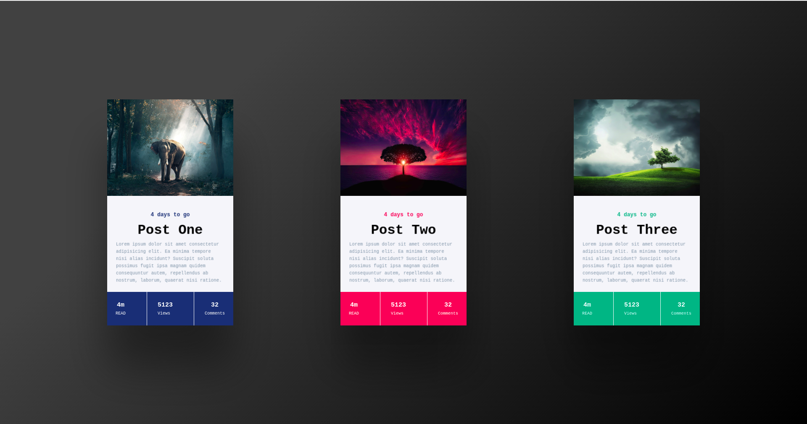

# Vanila-tilt-project

A sass project made with vanila-tilt-js library

## Installation via github:
1. Clone the github project.
2. `cd vanila-tilt-project-master`
3. Run `npm install`

## Development mode
````
npm start
````
Go to `localhost` to view the project.

## Project screenshots




